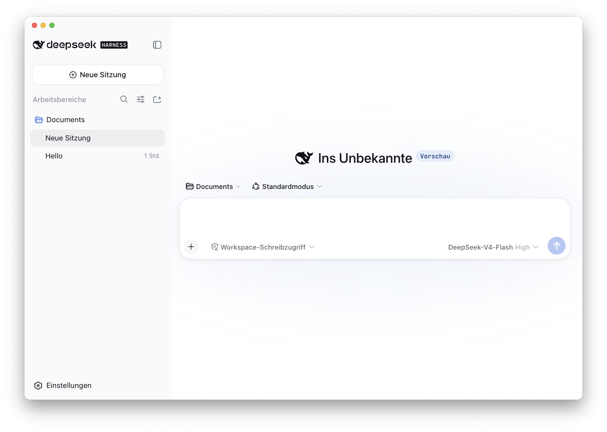

# DeepSeek Harness Desktop

[English](README.md) | [日本語](README.ja.md) | [简体中文](README.zh.md) | [繁體中文](README.zh-Hant.md) | [한국어](README.ko.md) | [Español](README.es.md) | [Português (Brasil)](README.pt-BR.md) | [Français](README.fr.md)

<p align="center"></p>

Ein inoffizieller Electron-Wrapper für DeepSeek Harness unter macOS. Auf Grundlage von DeepSeek Harness fügt dieses Projekt mehrsprachige Lokalisierung, die Integration von macOS-Fenstern und gebündelte Runtimes für die Distribution hinzu.

Dieses Projekt ist keine offizielle Desktop-Anwendung von DeepSeek AI. Das Upstream-Projekt ist [DeepSeek Harness](https://github.com/deepseek-ai/deepseek-harness).

## Funktionen

- Electron-Anwendung für macOS
- Lokalisierte Benutzeroberfläche für vereinfachtes und traditionelles Chinesisch, Englisch, Japanisch, Koreanisch, Spanisch, brasilianisches Portugiesisch, Deutsch und Französisch
- Automatische Sprachauswahl anhand der bevorzugten macOS-Sprache mit sprachspezifischen macOS-Systemschriften
- Node.js und die DeepSeek-Harness-Runtime in der Anwendung gebündelt
- Builds für Apple Silicon (arm64)

DeepSeek Harness befindet sich selbst in der Developer Preview und kann von Kompatibilitätsänderungen im Upstream-Projekt betroffen sein.

## Entwicklung

```sh
npm install
npm run start
```

Während der Entwicklung wird der Befehl `dsh` über den `PATH` aufgelöst. Distributions-Builds betten DeepSeek Harness und die Node.js-Runtime während des Builds in das Anwendungs-Bundle ein.

## Build

```sh
# Anwendungs-Bundle erzeugen
npm run build:dir

# DMG und Anwendungs-Bundle erzeugen
npm run build
```

`prepare-bundle` überprüft die Lokalisierungswörterbücher, lädt `@deepseek-ai/dsh@0.1.0-rc.6` und die Node.js-Runtime herunter und wendet anschließend die Lokalisierungen sowie die Liste der Drittanbieter-Lizenzen an. Für den Build der Anwendung ist eine Netzwerkverbindung erforderlich.

## Upstream-Projekt

- [DeepSeek Harness](https://github.com/deepseek-ai/deepseek-harness)
- [DeepSeek Harness README](https://github.com/deepseek-ai/deepseek-harness#readme)

## Community und Support

- Feedback und Fehlerberichte können über [GitHub Discussions](https://github.com/deepseek-ai/deepseek-harness/discussions) eingereicht werden.
- Füge deinem Plugin-Repository das Thema [dsh-plugin](https://github.com/topics/dsh-plugin) hinzu, damit es leichter gefunden werden kann.
- Um der DeepSeek-Harness-WeCom-Gruppe beizutreten, scanne den QR-Code des WeCom-Assistenten und fülle die Gruppenumfrage aus. Nach Abschluss der Umfrage wird dich der Assistent einladen.

<table>
  <thead>
    <tr>
      <th align="center">WeCom-Assistent</th>
      <th align="center">Gruppenumfrage</th>
      <th align="center">Offizielles WeChat-Konto</th>
    </tr>
  </thead>
  <tbody>
    <tr>
      <td align="center"></td>
      <td align="center"><a href="https://trtgsjkv6r.feishu.cn/share/base/form/shrcnIt5twSVdLGD52KJBckGCgg"></a></td>
      <td align="center"></td>
    </tr>
  </tbody>
</table>

## Lizenz

Code aus dem Upstream-Projekt und in diesem Fork hinzugefügter Code stehen unter der MIT License. Weitere Informationen findest du in [LICENSE](LICENSE).

Die Lizenzen der gebündelten Abhängigkeiten sind in der generierten [THIRD_PARTY_NOTICES.md](THIRD_PARTY_NOTICES.md) aufgeführt.
