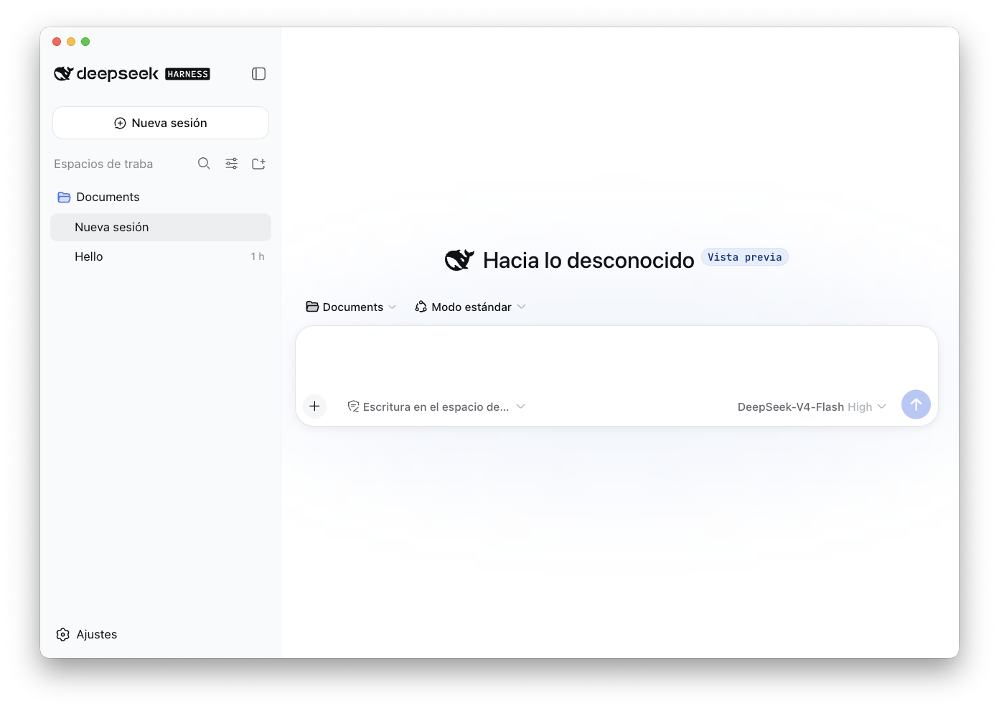

# DeepSeek Harness Desktop

[English](README.md) | [日本語](README.ja.md) | [简体中文](README.zh.md) | [繁體中文](README.zh-Hant.md) | [한국어](README.ko.md) | [Português (Brasil)](README.pt-BR.md) | [Deutsch](README.de.md) | [Français](README.fr.md)

<p align="center"></p>

Una envoltura Electron no oficial para macOS de DeepSeek Harness. Basado en DeepSeek Harness, este proyecto añade localización multilingüe, integración con las ventanas de macOS y runtimes incluidos para la distribución.

Este proyecto no es una aplicación de escritorio oficial de DeepSeek AI. El proyecto upstream es [DeepSeek Harness](https://github.com/deepseek-ai/deepseek-harness).

## Funciones

- Aplicación Electron para macOS
- Localización de la interfaz en chino simplificado, chino tradicional, inglés, japonés, coreano, español, portugués de Brasil, alemán y francés
- Selección automática del idioma según el idioma preferido de macOS, con fuentes del sistema de macOS específicas para cada idioma
- Node.js y el runtime de DeepSeek Harness incluidos en la aplicación
- Compilación para Apple Silicon (arm64)

DeepSeek Harness se encuentra en fase de Developer Preview y puede verse afectado por cambios de compatibilidad en el proyecto upstream.

## Desarrollo

```sh
npm install
npm run start
```

Durante el desarrollo, el comando `dsh` se resuelve desde `PATH`. Las compilaciones de distribución integran DeepSeek Harness y el runtime de Node.js en el bundle de la aplicación durante el proceso de compilación.

## Compilación

```sh
# Generar el bundle de la aplicación
npm run build:dir

# Generar un DMG y el bundle de la aplicación
npm run build
```

`prepare-bundle` verifica los diccionarios de localización, descarga `@deepseek-ai/dsh@0.1.0-rc.6` y el runtime de Node.js, y después aplica las localizaciones y la lista de licencias de terceros. Se necesita conexión a Internet para compilar la aplicación.

## Proyecto upstream

- [DeepSeek Harness](https://github.com/deepseek-ai/deepseek-harness)
- [README de DeepSeek Harness](https://github.com/deepseek-ai/deepseek-harness#readme)

## Comunidad y soporte

- Envía tus comentarios o informes de errores mediante [GitHub Discussions](https://github.com/deepseek-ai/deepseek-harness/discussions).
- Añade el tema [dsh-plugin](https://github.com/topics/dsh-plugin) a tu repositorio de plugins para facilitar su descubrimiento.
- Para unirte al grupo de WeCom de DeepSeek Harness, escanea el código QR del asistente de WeCom y completa la encuesta del grupo. El asistente te invitará después de completar la encuesta.

<table>
  <thead>
    <tr>
      <th align="center">Asistente de WeCom</th>
      <th align="center">Encuesta del grupo</th>
      <th align="center">Cuenta oficial de WeChat</th>
    </tr>
  </thead>
  <tbody>
    <tr>
      <td align="center"></td>
      <td align="center"><a href="https://trtgsjkv6r.feishu.cn/share/base/form/shrcnIt5twSVdLGD52KJBckGCgg"></a></td>
      <td align="center"></td>
    </tr>
  </tbody>
</table>

## Licencia

El código procedente del upstream y el código añadido en este fork se distribuyen bajo la MIT License. Consulta [LICENSE](LICENSE) para obtener más información.

Las licencias de las dependencias incluidas están enumeradas en el [THIRD_PARTY_NOTICES.md](THIRD_PARTY_NOTICES.md) generado.
