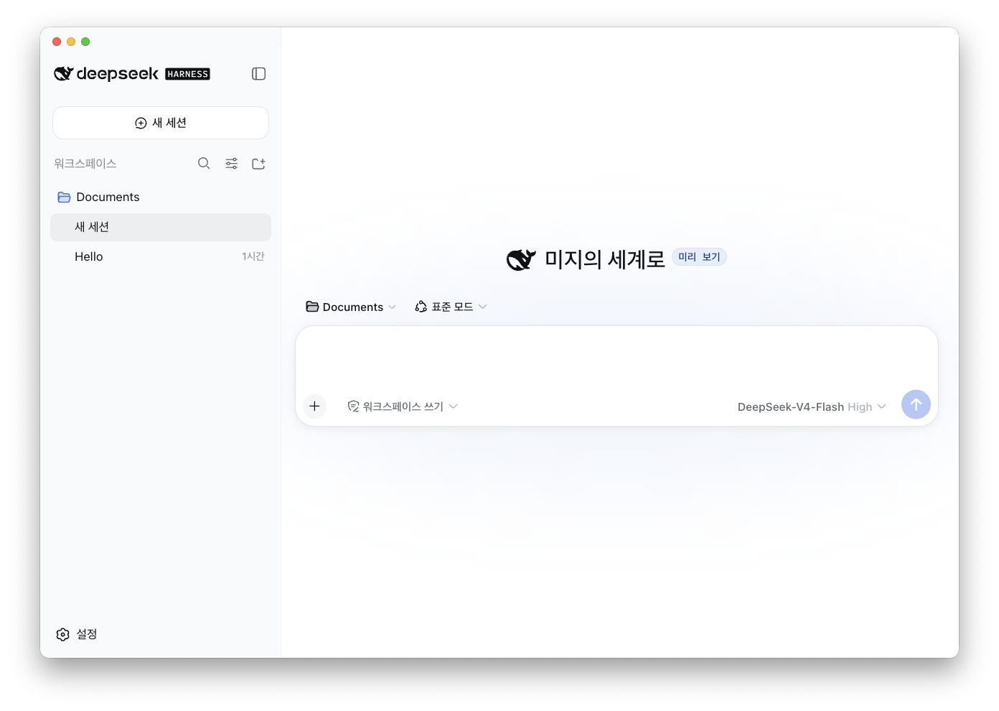

# DeepSeek Harness Desktop

[English](README.en.md) | [日本語](README.md) | [简体中文](README.zh.md) | [繁體中文](README.zh-Hant.md) | [Español](README.es.md) | [Português (Brasil)](README.pt-BR.md) | [Deutsch](README.de.md) | [Français](README.fr.md)

<p align="center"></p>

DeepSeek Harness를 위한 비공식 macOS Electron 래퍼입니다. DeepSeek Harness를 기반으로 다국어 현지화, macOS 윈도우 통합, 배포용 런타임 번들 기능을 추가합니다.

이 프로젝트는 DeepSeek AI의 공식 데스크톱 애플리케이션이 아닙니다. 업스트림 프로젝트는 [DeepSeek Harness](https://github.com/deepseek-ai/deepseek-harness)입니다.

## 기능

- macOS용 Electron 애플리케이션
- 중국어 간체, 중국어 번체, 영어, 일본어, 한국어, 스페인어, 브라질 포르투갈어, 독일어, 프랑스어 UI 현지화
- macOS 선호 언어에 따른 Auto 언어 선택 및 언어별 macOS 시스템 글꼴
- Node.js와 DeepSeek Harness 런타임을 애플리케이션에 번들
- Apple Silicon（arm64）용 빌드

DeepSeek Harness 자체는 Developer Preview 단계이며 업스트림 호환성 변경의 영향을 받을 수 있습니다.

## 개발

```sh
npm install
npm run start
```

개발 모드에서는 `dsh` 명령을 `PATH`에서 찾습니다. 배포 빌드에서는 빌드 시 DeepSeek Harness와 Node.js 런타임을 애플리케이션 번들에 포함합니다.

## 빌드

```sh
# 애플리케이션 번들 생성
npm run build:dir

# DMG와 애플리케이션 번들 생성
npm run build
```

`prepare-bundle`은 로컬라이제이션 사전을 검증하고 `@deepseek-ai/dsh@0.1.0-rc.6` 및 Node.js 런타임을 다운로드한 다음, 각 언어의 로컬라이제이션과 서드파티 라이선스 목록을 적용합니다. 애플리케이션을 빌드하려면 네트워크 연결이 필요합니다.

## 업스트림 프로젝트

- [DeepSeek Harness](https://github.com/deepseek-ai/deepseek-harness)
- [DeepSeek Harness README](https://github.com/deepseek-ai/deepseek-harness#readme)

## 커뮤니티 및 지원

- 피드백이나 버그 신고는 [GitHub Discussions](https://github.com/deepseek-ai/deepseek-harness/discussions)를 이용해 주세요.
- 플러그인 저장소에 [dsh-plugin](https://github.com/topics/dsh-plugin) 토픽을 추가하면 다른 사용자가 플러그인을 쉽게 찾을 수 있습니다.
- DeepSeek Harness WeCom 그룹에 참여하려면 WeCom 어시스턴트 QR 코드를 스캔하고 그룹 설문에 응답해 주세요. 설문을 완료하면 어시스턴트가 초대합니다.

<table>
  <thead>
    <tr>
      <th align="center">WeCom 어시스턴트</th>
      <th align="center">그룹 설문</th>
      <th align="center">WeChat 공식 계정</th>
    </tr>
  </thead>
  <tbody>
    <tr>
      <td align="center"></td>
      <td align="center"><a href="https://trtgsjkv6r.feishu.cn/share/base/form/shrcnIt5twSVdLGD52KJBckGCgg"></a></td>
      <td align="center"></td>
    </tr>
  </tbody>
</table>

## 라이선스

업스트림에서 가져온 코드와 이 fork에서 추가한 코드는 MIT License에 따라 배포됩니다. 자세한 내용은 [LICENSE](LICENSE)를 참고하세요.

번들에 포함된 의존성의 라이선스는 생성된 [THIRD_PARTY_NOTICES.md](THIRD_PARTY_NOTICES.md)에 정리되어 있습니다.
