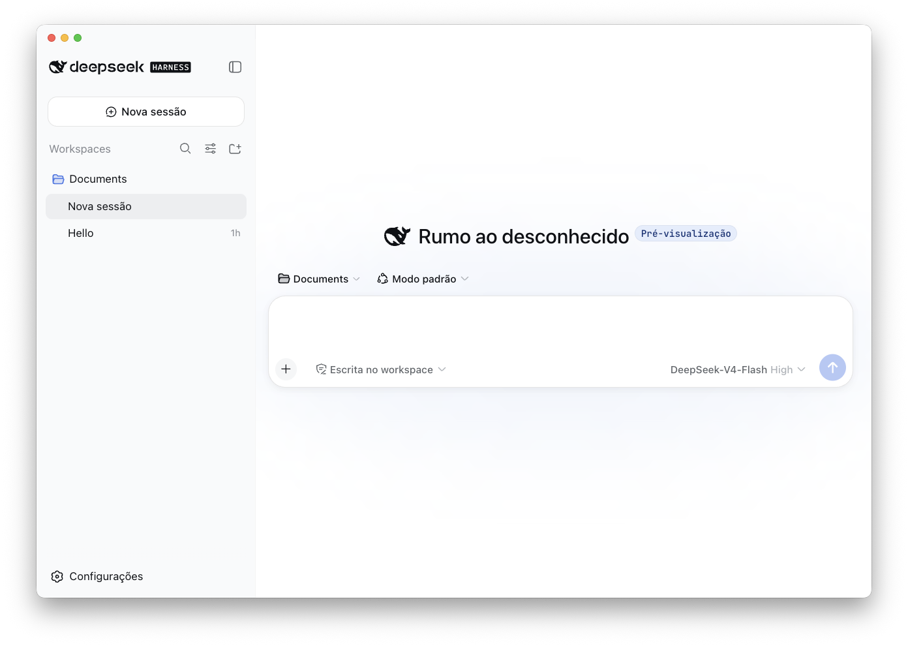

# DeepSeek Harness Desktop

[English](README.en.md) | [日本語](README.md) | [简体中文](README.zh.md) | [繁體中文](README.zh-Hant.md) | [한국어](README.ko.md) | [Español](README.es.md) | [Deutsch](README.de.md) | [Français](README.fr.md)

<p align="center"></p>

Um wrapper Electron não oficial para macOS do DeepSeek Harness. Baseado no DeepSeek Harness, este projeto adiciona localização multilíngue, integração com as janelas do macOS e runtimes incluídos para distribuição.

Este projeto não é um aplicativo oficial para desktop da DeepSeek AI. O projeto upstream é o [DeepSeek Harness](https://github.com/deepseek-ai/deepseek-harness).

## Recursos

- Aplicativo Electron para macOS
- Localização da interface em chinês simplificado, chinês tradicional, inglês, japonês, coreano, espanhol, português do Brasil, alemão e francês
- Seleção automática do idioma com base no idioma preferido do macOS, usando fontes do sistema do macOS específicas para cada idioma
- Node.js e o runtime do DeepSeek Harness incluídos no aplicativo
- Builds para Apple Silicon (arm64)

O DeepSeek Harness está em fase de Developer Preview e pode ser afetado por mudanças de compatibilidade no upstream.

## Desenvolvimento

```sh
npm install
npm run start
```

Durante o desenvolvimento, o comando `dsh` é resolvido a partir do `PATH`. Os builds de distribuição incorporam o DeepSeek Harness e o runtime do Node.js ao bundle do aplicativo durante o build.

## Build

```sh
# Gerar o bundle do aplicativo
npm run build:dir

# Gerar um DMG e o bundle do aplicativo
npm run build
```

`prepare-bundle` verifica os dicionários de localização, baixa `@deepseek-ai/dsh@0.1.0-rc.6` e o runtime do Node.js e, em seguida, aplica as localizações e a lista de licenças de terceiros. É necessária uma conexão de rede para fazer o build do aplicativo.

## Projeto upstream

- [DeepSeek Harness](https://github.com/deepseek-ai/deepseek-harness)
- [README do DeepSeek Harness](https://github.com/deepseek-ai/deepseek-harness#readme)

## Comunidade e suporte

- Envie feedback ou relatos de bugs pelo [GitHub Discussions](https://github.com/deepseek-ai/deepseek-harness/discussions).
- Adicione o tópico [dsh-plugin](https://github.com/topics/dsh-plugin) ao seu repositório de plugins para facilitar que outras pessoas o encontrem.
- Para entrar no grupo do DeepSeek Harness no WeCom, escaneie o QR code do assistente do WeCom e preencha a pesquisa do grupo. O assistente enviará o convite depois que você concluir a pesquisa.

<table>
  <thead>
    <tr>
      <th align="center">Assistente do WeCom</th>
      <th align="center">Pesquisa do grupo</th>
      <th align="center">Conta oficial do WeChat</th>
    </tr>
  </thead>
  <tbody>
    <tr>
      <td align="center"></td>
      <td align="center"><a href="https://trtgsjkv6r.feishu.cn/share/base/form/shrcnIt5twSVdLGD52KJBckGCgg"></a></td>
      <td align="center"></td>
    </tr>
  </tbody>
</table>

## Licença

O código originado no upstream e o código adicionado neste fork são licenciados sob a MIT License. Consulte [LICENSE](LICENSE) para obter mais informações.

As licenças das dependências incluídas estão listadas no [THIRD_PARTY_NOTICES.md](THIRD_PARTY_NOTICES.md) gerado.
