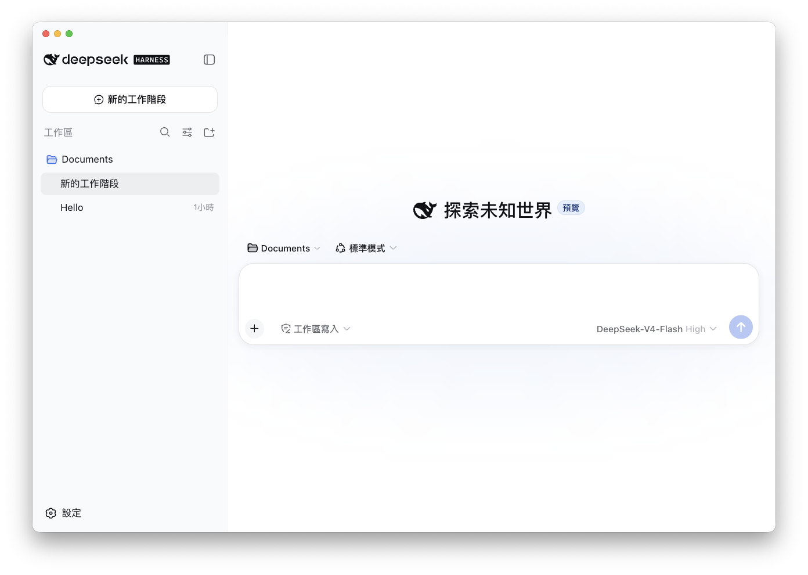

# DeepSeek Harness Desktop

[English](README.en.md) | [日本語](README.md) | [简体中文](README.zh.md) | [한국어](README.ko.md) | [Español](README.es.md) | [Português (Brasil)](README.pt-BR.md) | [Deutsch](README.de.md) | [Français](README.fr.md)

<p align="center"></p>

這是 DeepSeek Harness 的非官方 macOS Electron 封裝版本。本專案以 DeepSeek Harness 為基礎，加入多語言在地化、macOS 視窗整合，以及供發佈使用的執行環境打包。

本專案不是 DeepSeek AI 的官方桌面應用程式。上游專案是 [DeepSeek Harness](https://github.com/deepseek-ai/deepseek-harness)。

## 功能

- macOS Electron 應用程式
- 簡體中文、繁體中文、英文、日文、韓文、西班牙文、巴西葡萄牙文、德文與法文介面在地化
- 根據 macOS 偏好語言自動選擇介面語言，並使用對應的 macOS 系統字型
- 將 Node.js 與 DeepSeek Harness 執行環境隨應用程式一起打包
- 支援 Apple Silicon（arm64）建置

DeepSeek Harness 本身處於 Developer Preview 階段，可能會受到上游相容性變更的影響。

## 開發

```sh
npm install
npm run start
```

開發啟動時會從 `PATH` 解析 `dsh` 指令。發佈建置會在建置時將 DeepSeek Harness 與 Node.js 執行環境嵌入應用程式套件。

## 建置

```sh
# 產生應用程式套件
npm run build:dir

# 產生 DMG 與應用程式套件
npm run build
```

`prepare-bundle` 會先驗證在地化字典，再下載 `@deepseek-ai/dsh@0.1.0-rc.6` 與 Node.js 執行環境，接著套用各語言在地化和第三方授權清單。建置應用程式需要網路連線。

## 上游專案

- [DeepSeek Harness](https://github.com/deepseek-ai/deepseek-harness)
- [DeepSeek Harness README](https://github.com/deepseek-ai/deepseek-harness#readme)

## 社群與支援

- 歡迎透過 [GitHub Discussions](https://github.com/deepseek-ai/deepseek-harness/discussions) 提交意見回饋或 bug 報告。
- 為你的外掛儲存庫加入 [dsh-plugin](https://github.com/topics/dsh-plugin) 主題，方便其他人找到你的外掛。
- 歡迎加入 DeepSeek Harness 企業微信社群：掃描企業微信小助手 QR code 並填寫入群問卷，完成後小助手會邀請你加入。

<table>
  <thead>
    <tr>
      <th align="center">企業微信小助手</th>
      <th align="center">入群問卷</th>
      <th align="center">微信公眾號</th>
    </tr>
  </thead>
  <tbody>
    <tr>
      <td align="center"></td>
      <td align="center"><a href="https://trtgsjkv6r.feishu.cn/share/base/form/shrcnIt5twSVdLGD52KJBckGCgg"></a></td>
      <td align="center"></td>
    </tr>
  </tbody>
</table>

## 授權條款

上游程式碼與本 fork 新增的程式碼均採用 MIT License。詳情請參閱 [LICENSE](LICENSE)。

隨附相依套件的授權條款列於產生的 [THIRD_PARTY_NOTICES.md](THIRD_PARTY_NOTICES.md) 中。
