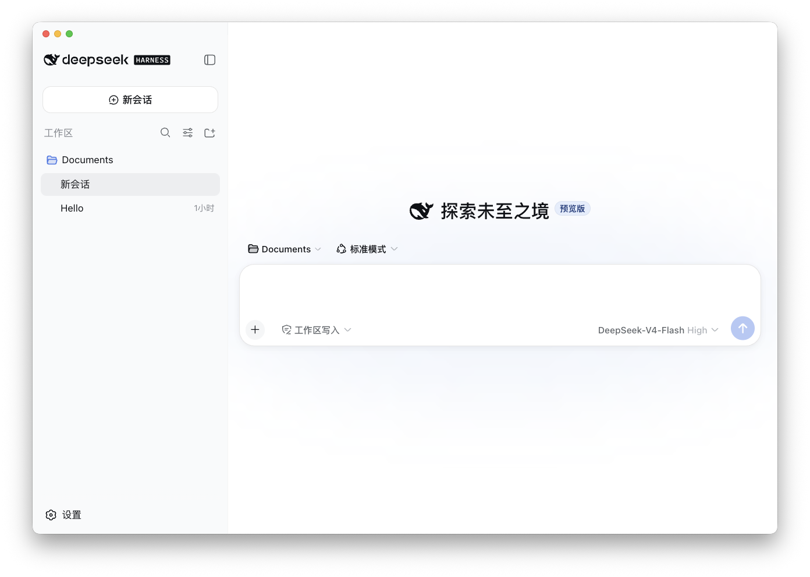

# DeepSeek Harness Desktop

[English](README.en.md) | [日本語](README.md) | [繁體中文](README.zh-Hant.md) | [한국어](README.ko.md) | [Español](README.es.md) | [Português (Brasil)](README.pt-BR.md) | [Deutsch](README.de.md) | [Français](README.fr.md)

<p align="center"></p>

这是 DeepSeek Harness 的非官方 macOS Electron 封装版本。该项目基于 DeepSeek Harness，增加了多语言本地化、macOS 窗口集成，以及用于发布的运行时打包。

本项目不是 DeepSeek AI 官方桌面应用。上游项目是 [DeepSeek Harness](https://github.com/deepseek-ai/deepseek-harness)。

## 功能

- 面向 macOS 的 Electron 应用
- 简体中文、繁体中文、英语、日语、韩语、西班牙语、巴西葡萄牙语、德语和法语界面本地化
- 根据 macOS 首选语言自动选择界面语言，并使用对应的 macOS 系统字体
- 将 Node.js 和 DeepSeek Harness 运行时随应用一起打包
- 面向 Apple Silicon（arm64）的构建

DeepSeek Harness 本身处于 Developer Preview 阶段，可能会受到上游兼容性变更的影响。

## 开发

```sh
npm install
npm run start
```

开发启动时，会从 `PATH` 中解析 `dsh` 命令。发布构建会在构建时将 DeepSeek Harness 和 Node.js 运行时嵌入应用程序包。

## 构建

```sh
# 生成应用程序包
npm run build:dir

# 生成 DMG 和应用程序包
npm run build
```

`prepare-bundle` 会先验证本地化词典，再下载 `@deepseek-ai/dsh@0.1.0-rc.6` 和 Node.js 运行时，然后应用各语言本地化和第三方许可证列表。构建应用需要网络连接。

## 上游项目

- [DeepSeek Harness](https://github.com/deepseek-ai/deepseek-harness)
- [DeepSeek Harness README](https://github.com/deepseek-ai/deepseek-harness#readme)

## 社区与支持

- 欢迎通过 [GitHub Discussions](https://github.com/deepseek-ai/deepseek-harness/discussions) 提交反馈或 bug 报告。
- 为你的插件仓库添加 [dsh-plugin](https://github.com/topics/dsh-plugin) 话题，便于被发现。
- 欢迎加入 DeepSeek Harness 企微群：扫码添加企微小助手并填写入群问卷，完成后小助手会邀请你入群。

<table>
  <thead>
    <tr>
      <th align="center">企微小助手</th>
      <th align="center">入群问卷</th>
      <th align="center">微信公众号</th>
    </tr>
  </thead>
  <tbody>
    <tr>
      <td align="center"></td>
      <td align="center"><a href="https://trtgsjkv6r.feishu.cn/share/base/form/shrcnIt5twSVdLGD52KJBckGCgg"></a></td>
      <td align="center"></td>
    </tr>
  </tbody>
</table>

## 许可证

上游代码和本 fork 新增的代码均采用 MIT License。详情请参阅 [LICENSE](LICENSE)。

随附依赖包的许可证列在生成的 [THIRD_PARTY_NOTICES.md](THIRD_PARTY_NOTICES.md) 中。
